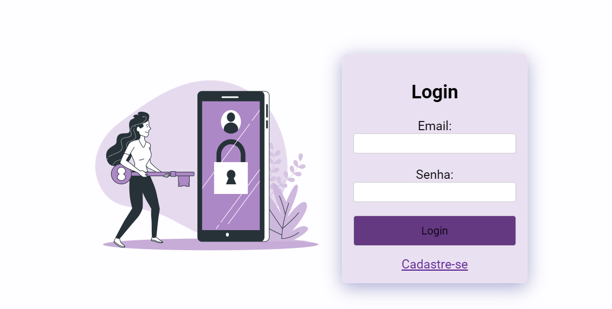

# Sistema de Login e Cadastro em PHP

Este é um projeto de sistema de login e cadastro desenvolvido em PHP para gerenciar o acesso de usuários a um sistema web. O sistema possui uma interface simples e é rápido para personalizar e integrar a outros projetos.

## Tecnologias Utilizadas

- PHP 
- JavaScript 
- XAMPP 
  - Apache 
  - MySQL 
- HTML
- CSS

## Telas do Sistema

### Tela de Login (loginimg)

### Tela de Cadastro (cadimg)

## Funcionalidades Adicionais

### Cadastro de Produtos

- Permite aos usuários cadastrar novos produtos no sistema.
- Informações como nome do produto, quantidade, tipo e valor são inseridas através deste formulário.
- A imagem acima representa a tela de cadastro de produtos no sistema.

### Visualização e Exclusão de Produtos

- Os produtos cadastrados são exibidos em uma lista para visualização.
- Cada produto é apresentado em uma caixa com informações detalhadas.
- Também é possível excluir produtos diretamente desta tela.

## Funcionalidades

- Formulário de cadastro de novos usuários.
- Formulário de login para acesso ao sistema.
- Validação de dados no lado do servidor (PHP).
- Integração com banco de dados MySQL para armazenamento seguro de informações de usuários.

## Como Usar

1. Clone este repositório para o seu ambiente de desenvolvimento local.
2. Configure o XAMPP para executar o servidor Apache e o MySQL.
3. Importe o arquivo SQL (`Database_Model.sql`) fornecido utilizando o PHPMyAdmin para criar a estrutura do banco de dados.
4. Acesse o sistema através do seu navegador para testar as funcionalidades de login e cadastro.

## Personalização

O sistema é rápido e fácil de personalizar. Você pode ajustar a interface, adicionar novas funcionalidades e integrá-lo aos seus projetos web conforme necessário.

## Contribuições

Contribuições são bem-vindas! Sinta-se à vontade para enviar pull requests e sugerir melhorias para o projeto.

## Licença
Criação e Desenvolvimento: Letícia Eltermann
Este projeto está sob a licença [MIT](LICENSE).
